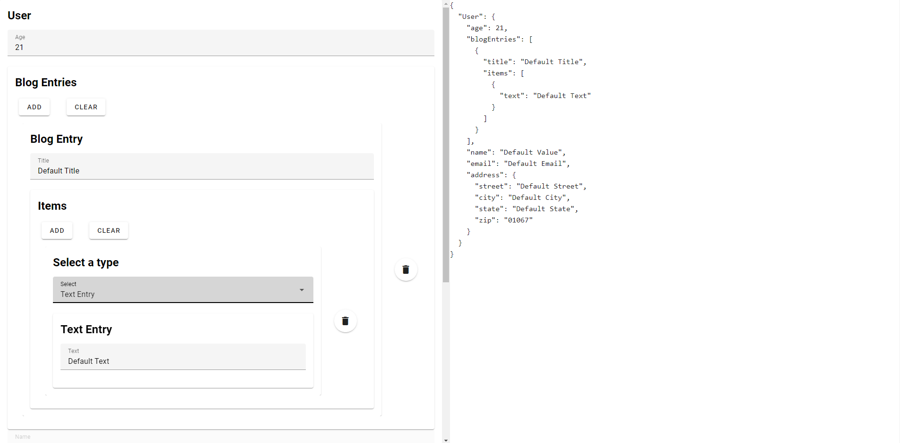
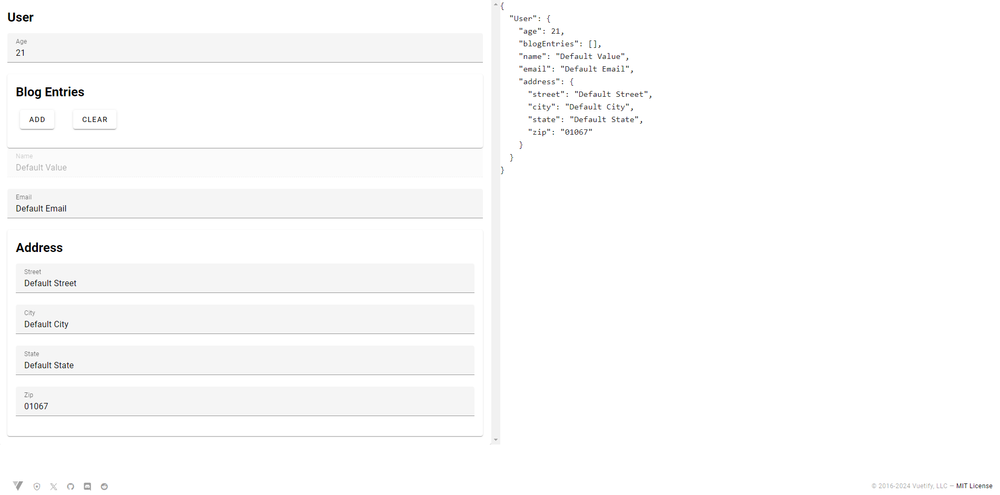

# AutoFormVuetify

The smart and easy way to create JSON compliant forms.
Use this as a starting point for software that needs to create JSON objects like configs, settings, etc.

## Installation

NPM package will be available soon.

# Screenshots

